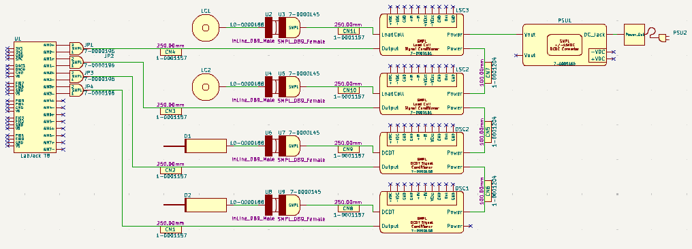
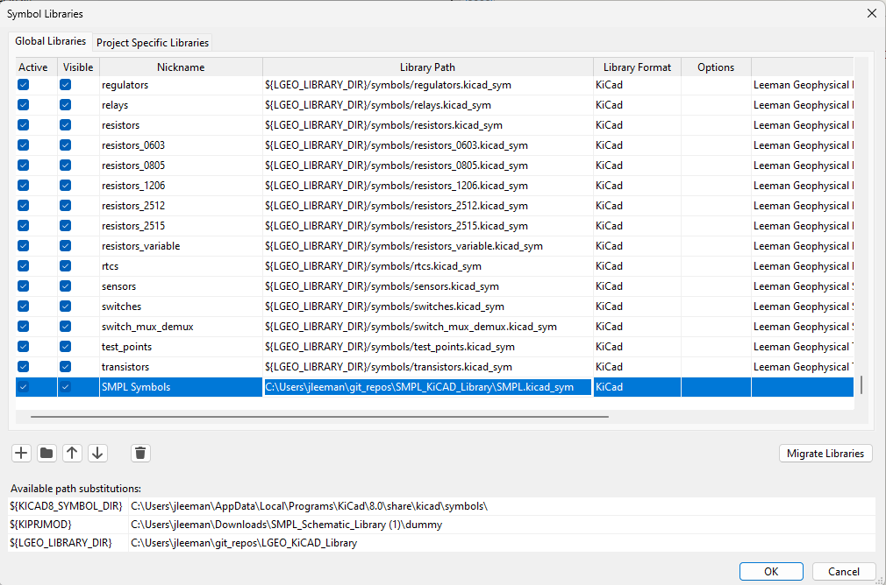

# SMPL KiCAD Library

We love the SMPL (Simple Modular Physical Link) system and know you do too! This
library exists to help you design your next SMPL based system in the free KiCAD
tool. Export a bill of materials to help make sure you get everything you need
in one order, list out what cables you use, and more. We use this library in our
own consulting work when we design systems using the SMPL boards and it saves
hours of headache and makes documenting that thin you'll remember later (but
don't) easy.

The library is not meant to represent every electrical connection (i.e. the 4
wires from a load cell), but more the system design. We recommend using wires to
represent SMPL cables instead of individual electrical connections. We have also
included components that represent our pre-cut and assembled SMPL cables that
you can place on the schematic alongside the wire they represent to make sure
you know what length you used and to create a bill of materials (BOM) that you
can place an order from.

## Installation
Installing the library is easy and takes less than 2 minutes!

1. Download a copy of this git repository. You can download a zip by clinking
   the green "code" button at the upper right hand of the file list. If you're
   familiar with git we recommend cloning the repository so that as we continue
   to add products to the library you can update with a simple `git pull`
   command. If you're not familiar with git, no sweat, you'll just download and
   replace the library folder periodically when you want to update.

1. Put the folder (unzipped if you downloaded a zip file) somewhere you want to
   keep it "forever". We like having a folder called `git_repos` in our home
   directory, but you can use documents or wherever else you prefer.

1. Open KiCAD and go to the schematic editor.

1. Click Preferences -> Manage Symbol Libraries

1. At the top of the dialog box select "Global Libraries" if you want to add the
   SMPL library for all projects (recommended) or select "Project Specific
   Libraries" if you just want to add it to the project that is currently open.

1. Click the add (+) button and nickname the library "SMPL Symbols".

1. In the Library Path column click the folder icon and browse to where you have
   put the folder and select the `SMPL.kicad_sym` file.

1. Click OK - you're done! Now go design something cool.

## Problems
See a problem? Feel free to open an issue, create a pull request, or contact our
support team!
